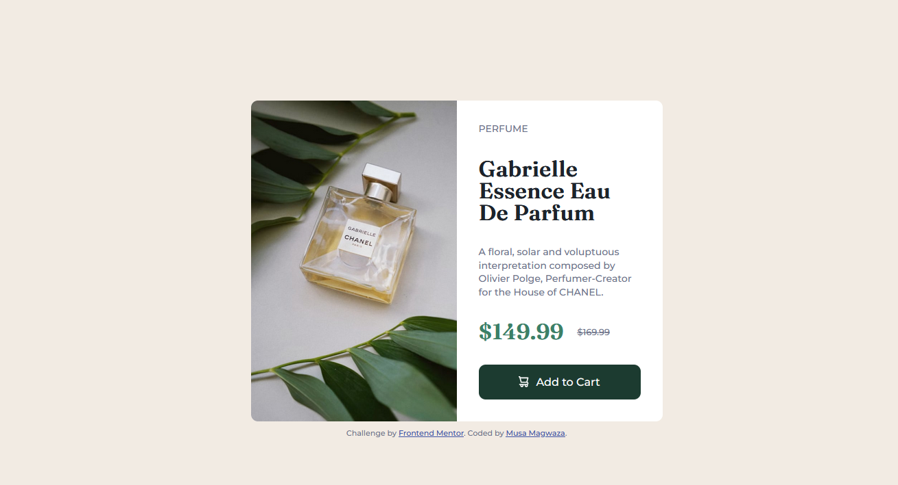

# Product preview card component - Responsive

This project a coding chalenge from frontendmentor.io

## Table of contents

- [Overview](#overview)
  - [Original Design](#original-design)
  - [My Screenshot](#my-screenshot)
  - [Links](#links)
- [My process](#my-process)
  - [Built with](#built-with)

## Overview

### The challenge

The challenge was to build out this product preview card component and get it looking as close to the design as possible.

Users should be able to:

- View the optimal layout depending on their device's screen size
- See hover and focus states for interactive elements

### Original Design

### My Screenshot

### Links

- Frontend Challenge: [https://www.frontendmentor.io/challenges/product-preview-card-component-GO7UmttRfa]()
- Live Site URL: [https://io2puv.csb.app/]()
- My Previous Solution: [https://codepen.io/itsmusa/pen/rNdrBJV]()

## My process

### Built with

- HTML5
- CSS
- sass
- Responsive Design

